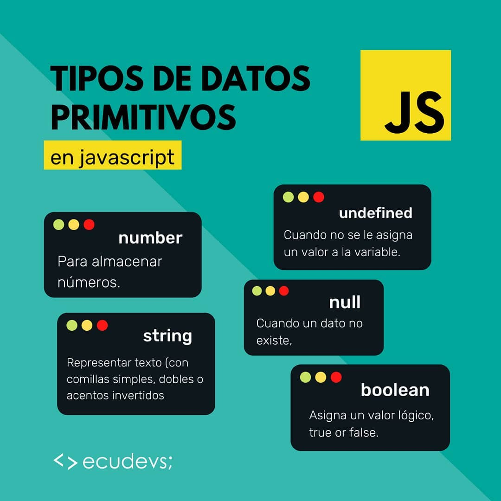

###############
Checkpoint 7
###############

***************************************************************************
¿Qué diferencia a Javascript de cualquier otro lenguaje de programación?
***************************************************************************

JavaScript es un lenguaje de programación de alto nivel, interpretado y orientado a objetos, utilizado principalmente para crear interactividad en páginas web. Junto con HTML y CSS, forma la tríada fundamental de tecnologías web.

.. image:: images/JS.png
  :width: 400
  :alt: Javascript logo

Historia
===============

JavaScript fue creado por Brendan Eich en 1995 mientras trabajaba en Netscape Communications Corporation. Originalmente se llamaba "LiveScript", pero luego fue renombrado a JavaScript por motivos de marketing para capitalizar la creciente popularidad del lenguaje Java en ese momento. En diciembre de 1995, JavaScript fue lanzado con Netscape Navigator 2.0.

Diferencias con otros lenguajes
================================

JavaScript es un lenguaje de programación ampliamente utilizado que tiene varias características distintivas que lo diferencian de otros lenguajes. Aquí hay algunas diferencias clave:

1. **Lenguaje de programación del lado del cliente:** JavaScript es principalmente un lenguaje de programación del lado del cliente, lo que significa que se ejecuta en el navegador web del usuario. Esto permite que los desarrolladores creen aplicaciones web interactivas y dinámicas que pueden responder a la interacción del usuario en tiempo real, sin necesidad de comunicarse con el servidor para cada acción.

.. code-block:: javascript

 // Ejemplo de JavaScript en un archivo HTML
   

2. **Lenguaje interpretado:** JavaScript es un lenguaje interpretado, lo que significa que no requiere un paso de compilación antes de la ejecución. Los navegadores web interpretan directamente el código JavaScript y lo ejecutan en tiempo real.

.. code-block:: javascript

   // Ejemplo de declaración de variable en JavaScript
   let nombre = "Juan";
 

3. **Tipado dinámico:** JavaScript es un lenguaje de tipado dinámico, lo que significa que no es necesario especificar el tipo de una variable al declararla. El tipo de datos de una variable puede cambiar durante la ejecución del programa.

.. code-block:: javascript

   // Ejemplo de tipado dinámico en JavaScript
   let edad = 25; // edad es de tipo number
   edad = "veinticinco"; // ahora edad es de tipo string

4. **Funciones de primera clase:** En JavaScript, las funciones son tratadas como objetos de primera clase, lo que significa que pueden ser asignadas a variables, pasadas como argumentos a otras funciones y devueltas como valores de otras funciones.

.. code-block:: javascript

   // Ejemplo de función asignada a una variable
   const suma = function(a, b) {
     return a + b;
   };

5. **Modelo de objetos basado en prototipos:** A diferencia de otros lenguajes que utilizan clases para definir objetos, JavaScript utiliza un modelo de objetos basado en prototipos. Los objetos en JavaScript pueden heredar propiedades y métodos de otros objetos a través de su prototipo.

.. code-block:: javascript

   // Ejemplo de creación de objetos y herencia prototípica en JavaScript
   let persona = {
     nombre: "Ana",
     edad: 30,
     saludar: function() {
       return "Hola, soy " + this.nombre;
     }
   };

En resumen, JavaScript es único debido a su capacidad de ejecución en el navegador, su tipado dinámico, su flexibilidad en el manejo de funciones y su modelo de objetos basado en prototipos. Estas características hacen que JavaScript sea un lenguaje poderoso y versátil para el desarrollo web y más allá.

Fuentes
===============

- Guías de DevCamp.
- https://www.c-sharpcorner.com/article/how-javascript-is-different-from-other-programming-languages/
- https://www.aeioros.com/javascript-frente-otros-lenguajes-de-programacion-populares
- https://www.um.es/docencia/barzana/DAWEB/Lenguaje-de-programacion-JavaScript-1.pdf

 

*********************************************
¿Cuáles son algunos tipos de datos JS?
*********************************************

JavaScript es un lenguaje de programación dinámicamente tipado, lo que significa que no es necesario declarar el tipo de una variable al crearla. JavaScript admite varios tipos de datos, que se pueden clasificar en los siguientes grupos:

Tipos de datos primitivos
================================

- **Número (Number):** Representa valores numéricos enteros o de punto flotante. Ejemplos:

  .. code-block:: javascript

     let entero = 10;
     let flotante = 3.14;

- **Cadena (String):** Representa una secuencia de caracteres. Las cadenas se pueden definir utilizando comillas simples o dobles.

  .. code-block:: javascript

     let mensaje = "Hola, mundo!";

- **Booleano (Boolean):** Representa un valor verdadero (`true`) o falso (`false`).

  .. code-block:: javascript

     let esVerdadero = true;
     let esFalso = false;

- **Undefined:** Representa un valor no definido. Si una variable se declara pero no se le asigna un valor, su valor será `undefined`.

  .. code-block:: javascript

     let x;

- **Null:** Representa la ausencia de valor o un valor nulo.

  .. code-block:: javascript

     let y = null;

Tipos de datos compuestos
================================

- **Array:** Representa una colección ordenada de elementos. Los elementos de un array pueden ser de cualquier tipo de datos, incluidos otros arrays.

  .. code-block:: javascript

     let numeros = [1, 2, 3, 4, 5];
     let colores = ['rojo', 'verde', 'azul'];

- **Objeto (Object):** Representa una colección de pares clave-valor. Las propiedades de un objeto pueden ser de cualquier tipo de datos, incluidas funciones u otros objetos.

  .. code-block:: javascript

     let persona = {
       nombre: "Juan",
       edad: 30,
       esEstudiante: true
     };

Tipos de datos especiales
================================

- **Function (Función):** Representa una función en JavaScript, que es un tipo de objeto.

  .. code-block:: javascript

     function sumar(a, b) {
       return a + b;
     }

- **Symbol (Símbolo):** Introducido en ECMAScript 6, representa un identificador único e inmutable.

  .. code-block:: javascript

     const simbolo = Symbol('descripcion');
     
Identificación de Tipos de Datos en JavaScript
===============================================

En JavaScript, puedes identificar el tipo de dato de una variable utilizando operadores y funciones específicas. Aquí hay varios métodos para identificar los tipos de datos:

1. **Operador `typeof`:** El operador `typeof` te permite determinar el tipo de dato de una variable.

   - **Número:**

     .. code-block:: javascript

        let numero = 123;
        console.log(typeof numero); // "number"

   - **Cadena:**

     .. code-block:: javascript

        let cadena = "Hola, mundo!";
        console.log(typeof cadena); // "string"

   - **Booleano:**

     .. code-block:: javascript

        let booleano = true;
        console.log(typeof booleano); // "boolean"

   - **Undefined:**

     .. code-block:: javascript

        let x;
        console.log(typeof x); // "undefined"

   - **Null:**

     .. code-block:: javascript

        let y = null;
        console.log(typeof y); // "object" 

    (¡Cuidado! typeof null devuelve "object" por razones históricas. Null es su propio tipo, no un objeto.)

   - **Objeto:**

     .. code-block:: javascript

        let objeto = { nombre: "Juan", edad: 30 };
        console.log(typeof objeto); // "object"

Identificar el tipo de dato de una variable en JavaScript es esencial para escribir código seguro y efectivo.

Conclusión
===========

JavaScript es un lenguaje de programación versátil que admite una variedad de tipos de datos para representar diferentes tipos de valores. Comprender los tipos de datos en JavaScript es fundamental para escribir código eficiente y robusto.

Fuentes
===============

- Guías de DevCamp.
- https://developer.mozilla.org/es/docs/Web/JavaScript/Data_structures
- https://lenguajejs.com/javascript/introduccion/tipos-de-datos/
- https://www.freecodecamp.org/espanol/news/tipos-de-datos-en-javascript/

**************************************************
¿Cuáles son las tres funciones de String en JS?
**************************************************

Las cadenas (Strings) son una parte fundamental de JavaScript y proporcionan una amplia gama de funciones integradas para manipular y trabajar con texto. A continuación se presentan algunas de las funciones más comunes de String en JavaScript:

1. **Longitud de una cadena (`length`):** La propiedad `length` se utiliza para obtener la longitud de una cadena.

   .. code-block:: javascript

      let cadena = "Hola, mundo!";
      console.log(cadena.length); // 12

2. **Convertir a Mayúsculas (`toUpperCase()`):** El método `toUpperCase()` se utiliza para convertir una cadena a mayúsculas.

   .. code-block:: javascript

      let minusculas = "hola, mundo!";
      let mayusculas = minusculas.toUpperCase();
      console.log(mayusculas); // "HOLA, MUNDO!"

3. **Convertir a Minúsculas (`toLowerCase()`):** El método `toLowerCase()` se utiliza para convertir una cadena a minúsculas.

   .. code-block:: javascript

      let mayusculas = "HOLA, MUNDO!";
      let minusculas = mayusculas.toLowerCase();
      console.log(minusculas); // "hola, mundo!"

4. **Concatenación (`concat()`):** El método `concat()` se utiliza para concatenar una o más cadenas con otra cadena.

   .. code-block:: javascript

      let cadena1 = "Hola";
      let cadena2 = "mundo";
      let saludo = cadena1.concat(", ", cadena2);
      console.log(saludo); // "Hola, mundo"

5. **Obtener un Carácter (`charAt()`):** El método `charAt()` se utiliza para obtener el carácter en una posición específica de una cadena.

   .. code-block:: javascript

      let cadena = "Hola, mundo!";
      let caracter = cadena.charAt(0);
      console.log(caracter); // "H"

6. **Buscar una Subcadena (`indexOf()` y `lastIndexOf()`):** Los métodos `indexOf()` y `lastIndexOf()` se utilizan para buscar la primera o última ocurrencia de una subcadena en una cadena, respectivamente.

   .. code-block:: javascript

      let cadena = "Hola, mundo!";
      let primera = cadena.indexOf("mundo");
      let ultima = cadena.lastIndexOf("o");
      console.log(primera); // 6
      console.log(ultima); // 10

7. **Extraer una Subcadena (`substring()`):** El método `substring()` se utiliza para extraer una parte de una cadena, especificando el inicio y el final.

   .. code-block:: javascript

      let cadena = "Hola, mundo!";
      let subcadena = cadena.substring(6, 11);
      console.log(subcadena); // "mundo"

8. **Reemplazar (`replace()`):** El método `replace()` se utiliza para reemplazar parte de una cadena con otra cadena.

   .. code-block:: javascript

      let cadena = "Hola, mundo!";
      let nuevaCadena = cadena.replace("mundo", "Universo");
      console.log(nuevaCadena); // "Hola, Universo!"

9. **Dividir en Subcadenas (`split()`):** El método `split()` se utiliza para dividir una cadena en un array de subcadenas, utilizando un separador especificado.

   .. code-block:: javascript

      let cadena = "Hola, mundo!";
      let palabras = cadena.split(", ");
      console.log(palabras); // ["Hola", "mundo!"]

10. **Recortar Espacios en Blanco (`trim()`):** El método `trim()` se utiliza para eliminar los espacios en blanco al principio y al final de una cadena.

    .. code-block:: javascript

       let cadena = "   Hola, mundo!   ";
       let limpia = cadena.trim();
       console.log(limpia); // "Hola, mundo!"

Conclusión
===========

Las funciones de String en JavaScript ofrecen una amplia gama de herramientas para manipular y trabajar con texto de manera efectiva. Al comprender y utilizar estas funciones, puedes realizar tareas como manipulación de texto, búsqueda de subcadenas, reemplazo de texto y mucho más de manera sencilla y eficiente.

Fuentes
===============

- Guías de DevCamp.
- https://desarrolloweb.com/articulos/objetos-string-javascript.html
- https://developer.mozilla.org/es/docs/Learn/JavaScript/First_steps/Useful_string_methods
- https://www.aprenderaprogramar.com/index.php?option=com_content&view=article&id=822:funciones-javascript-cadenas-texto-tolowercase-charat-substring-split-replace-replaceall-indexof-cu01142e&catid=78&Itemid=206

**************************************************
¿Qué es un condicional?
**************************************************

Los condicionales son estructuras de control que permiten ejecutar diferentes bloques de código dependiendo de si una condición especificada es verdadera o falsa. En JavaScript, los condicionales se utilizan para tomar decisiones en el flujo de ejecución de un programa. A continuación se presenta una explicación detallada de los condicionales en JavaScript:

Sintaxis de los Condicionales
=================================

En JavaScript, los condicionales se implementan principalmente a través de las declaraciones `if`, `else if` y `else`. La sintaxis básica es la siguiente:

.. code-block:: javascript

   if (condicion) {
       // Bloque de código a ejecutar si la condición es verdadera
   } else if (otraCondicion) {
       // Bloque de código a ejecutar si la otra condición es verdadera
   } else {
       // Bloque de código a ejecutar si ninguna de las condiciones anteriores es verdadera
   }

Operadores de Comparación
=================================

Los condicionales en JavaScript utilizan operadores de comparación para evaluar si una condición es verdadera o falsa. Algunos de los operadores de comparación más comunes son:

- `==` (igual a)
- `!=` (diferente a)
- `===` (estrictamente igual a valor y tipo)
- `!==` (estrictamente diferente a valor o tipo)
- `>` (mayor que)
- `<` (menor que)
- `>=` (mayor o igual que)
- `<=` (menor o igual que)

Ejemplos de Condicionales
=================================

A continuación se presentan algunos ejemplos de cómo se utilizan los condicionales en JavaScript:

- **Ejemplo 1: Verificar si un número es positivo, negativo o cero:**

  .. code-block:: javascript

     let numero = 0;
     if (numero > 0) {
         console.log("El número es positivo");
     } else if (numero < 0) {
         console.log("El número es negativo");
     } else {
         console.log("El número es cero");
     }

- **Ejemplo 2: Determinar si un número es par o impar:**

  .. code-block:: javascript

     let numero = 5;
     if (numero % 2 === 0) {
         console.log("El número es par");
     } else {
         console.log("El número es impar");
     }

- **Ejemplo 3: Verificar si una cadena es larga o corta:**

  .. code-block:: javascript

     let cadena = "Hola, mundo!";
     if (cadena.length > 10) {
         console.log("La cadena es larga");
     } else {
         console.log("La cadena es corta");
     }

Usos de los Condicionales
=================================

Los condicionales se utilizan en JavaScript para:

- Tomar decisiones basadas en ciertas condiciones.
- Controlar el flujo de ejecución de un programa.
- Validar datos de entrada.
- Ejecutar diferentes bloques de código según las circunstancias.

Además, los condicionales son esenciales en la construcción de estructuras más complejas como bucles y funciones condicionales.

Condicionales Compuestos en JavaScript
======================================

Los condicionales compuestos en JavaScript permiten combinar múltiples condiciones en una sola expresión lógica para tomar decisiones más complejas en el flujo de ejecución de un programa. A continuación, se presenta una explicación detallada de los condicionales compuestos en JavaScript:

1. **Sintaxis de los Condicionales Compuestos:**

   Los condicionales compuestos se implementan mediante la combinación de operadores lógicos, como `&&` (AND) y `||` (OR), para evaluar múltiples condiciones en una sola expresión. La sintaxis básica es la siguiente:

   .. code-block:: javascript

      if (condicion1 && condicion2) {
          // Bloque de código a ejecutar si ambas condiciones son verdaderas
      } else if (condicion1 || condicion2) {
          // Bloque de código a ejecutar si al menos una de las condiciones es verdadera
      } else {
          // Bloque de código a ejecutar si ninguna de las condiciones anteriores es verdadera
      }

2. **Ejemplos de Condicionales Compuestos:**

   A continuación se presentan algunos ejemplos de cómo se utilizan los condicionales compuestos en JavaScript:

   - **Ejemplo 1: Verificar si un número está dentro de un rango:**

     .. code-block:: javascript

        let numero = 15;
        if (numero >= 0 && numero <= 100) {
            console.log("El número está dentro del rango de 0 a 100");
        } else {
            console.log("El número está fuera del rango de 0 a 100");
        }

   - **Ejemplo 2: Verificar si un número es divisible por dos y tres:**

     .. code-block:: javascript

        let numero = 6;
        if (numero % 2 === 0 && numero % 3 === 0) {
            console.log("El número es divisible por dos y tres");
        } else {
            console.log("El número no es divisible por dos y tres");
        }

   - **Ejemplo 3: Verificar si una cadena contiene ciertas letras:**

     .. code-block:: javascript

        let cadena = "hola";
        if (cadena.includes("a") || cadena.includes("e")) {
            console.log("La cadena contiene las letras 'a' o 'e'");
        } else {
            console.log("La cadena no contiene las letras 'a' o 'e'");
        }

3. **Usos de los Condicionales Compuestos:**

   Los condicionales compuestos en JavaScript se utilizan para:

   - Evaluar múltiples condiciones en una sola expresión.
   - Tomar decisiones basadas en combinaciones de condiciones.
   - Controlar el flujo de ejecución de un programa de manera más precisa y flexible.

   Los condicionales compuestos son útiles cuando se necesita realizar acciones específicas solo cuando se cumplen ciertas combinaciones de condiciones.

Conclusión
===========

Los condicionales son una parte fundamental de JavaScript que permiten tomar decisiones y controlar el flujo de ejecución de un programa. Comprender la sintaxis, los operadores de comparación y los usos de los condicionales es esencial para escribir código efectivo y lógico en JavaScript.

Fuentes
===============

- Guías de DevCamp.
- https://www.freecodecamp.org/espanol/news/javascript-if-else-y-if-then-sentencias-condicionales-en-js/
- https://developer.mozilla.org/es/docs/Learn/JavaScript/Building_blocks/conditionals
- https://makeitrealcamp.gitbook.io/javascript-book/condicionales

******************************
¿Qué es un operador ternario?
******************************

Operadores Ternarios en JavaScript
===================================

Los operadores ternarios en JavaScript son una forma compacta y concisa de escribir condicionales para tomar decisiones en una sola línea de código. Son especialmente útiles cuando se necesita asignar un valor a una variable basado en una condición. A continuación se presenta una explicación detallada de los operadores ternarios en JavaScript:

1. **Sintaxis del Operador Ternario:**

   El operador ternario en JavaScript tiene la siguiente sintaxis:

   .. code-block:: javascript

      condicion ? expresion1 : expresion2

Donde `condicion` es una expresión que se evalúa como verdadera o falsa, `expresion1` es el valor que se asignará si la condición es verdadera, y `expresion2` es el valor que se asignará si la condición es falsa.

2. **Ejemplos de Operadores Ternarios:**

   A continuación se presentan algunos ejemplos de cómo se utilizan los operadores ternarios en JavaScript:

   - **Ejemplo 1: Verificar si un número es par o impar:**

     .. code-block:: javascript

        let numero = 5;
        let resultado = numero % 2 === 0 ? "par" : "impar";
        console.log("El número es " + resultado);

   - **Ejemplo 2: Determinar si una persona es mayor de edad:**

     .. code-block:: javascript

        let edad = 20;
        let mensaje = edad >= 18 ? "Es mayor de edad" : "Es menor de edad";
        console.log(mensaje);

   - **Ejemplo 3: Verificar si una cadena es corta o larga:**

     .. code-block:: javascript

        let cadena = "Hola";
        let longitud = cadena.length;
        let tamano = longitud <= 5 ? "corta" : "larga";
        console.log("La cadena es " + tamano);

3. **Explicación Detallada:**

   - El operador ternario comienza evaluando la `condicion`. Si la `condicion` es verdadera, se devuelve `expresion1`; de lo contrario, se devuelve `expresion2`.
   - Los operadores ternarios son una forma compacta de escribir condicionales simples y se utilizan comúnmente para asignar valores basados en condiciones.

4. **Usos de los Operadores Ternarios:**

   Los operadores ternarios en JavaScript se utilizan para:

   - Asignar valores a variables basados en condiciones.
   - Simplificar condicionales simples y evitar la repetición de código.
   - Escribir código más conciso y legible en situaciones donde se necesitan condicionales simples.

   Los operadores ternarios son especialmente útiles cuando se necesita tomar decisiones simples en una sola línea de código.

Conclusión
=============

Los operadores ternarios en JavaScript son una forma eficiente y concisa de escribir condicionales para tomar decisiones basadas en condiciones simples. Comprender la sintaxis, los ejemplos y los usos de los operadores ternarios es esencial para escribir código efectivo y legible en JavaScript.

Fuentes
===============

- Guías de DevCamp.
- https://developer.mozilla.org/es/docs/Web/JavaScript/Reference/Operators/Conditional_operator
- https://lenguajejs.com/fundamentos/estructuras-de-control/operador-ternario/
- https://desarrolloweb.com/articulos/operador-ternario-javascript

******************************************************************************************
¿Cuál es la diferencia entre una declaración de función y una expresión de función?
******************************************************************************************

Funciones en JavaScript
=======================

Las funciones son bloques de código reutilizables que realizan una tarea específica cuando se invocan. En JavaScript, las funciones son un concepto fundamental que permite modularizar el código, hacerlo más legible y reutilizable. A continuación se presenta una explicación detallada de las funciones en JavaScript:

1. **Definición de Funciones:**

   En JavaScript, una función se define utilizando la palabra clave `function`, seguida del nombre de la función y los parámetros entre paréntesis, seguidos por el cuerpo de la función entre llaves. Por ejemplo:

   .. code-block:: javascript

      function saludar(nombre) {
          console.log("¡Hola, " + nombre + "!");
      }

   Esta es una función simple llamada `saludar` que toma un parámetro `nombre` y muestra un mensaje de saludo en la consola.

2. **Invocación de Funciones:**

   Una vez definida, una función puede ser invocada en cualquier parte del código utilizando su nombre seguido de paréntesis que contienen los argumentos (si los hay). Por ejemplo:

   .. code-block:: javascript

      saludar("Juan");

   Esta llamada a la función `saludar` mostrará "¡Hola, Juan!" en la consola.

3. **Retorno de Valores:**

   Las funciones pueden devolver un valor utilizando la palabra clave `return`. Por ejemplo:

   .. code-block:: javascript

      function suma(a, b) {
          return a + b;
      }

   La función `suma` toma dos parámetros `a` y `b`, y devuelve la suma de los dos valores.

4. **Funciones Anónimas:**

   En JavaScript, también es posible definir funciones sin un nombre específico. Estas se conocen como funciones anónimas y se utilizan comúnmente como expresiones de función o como argumentos para otras funciones. Por ejemplo:

   .. code-block:: javascript

      let cuadrado = function(x) {
          return x * x;
      };

   Esta es una función anónima que calcula el cuadrado de un número.

5. **Funciones Flecha (Arrow Functions):**

   A partir de ECMAScript 6 (ES6), se introdujeron las funciones flecha, que proporcionan una sintaxis más corta y concisa para definir funciones. Por ejemplo:

   .. code-block:: javascript

      let doble = (x) => {
          return x * 2;
      };

   Esta es una función flecha que devuelve el doble de un número.

6. **Ventajas de las Funciones:**

   - **Reutilización de Código:** Las funciones permiten definir una tarea una vez y reutilizarla en múltiples lugares del código.
   - **Modularización:** Las funciones ayudan a dividir el código en bloques más pequeños y manejables, lo que facilita la comprensión y el mantenimiento.
   - **Abstracción:** Las funciones permiten abstraer la lógica compleja detrás de una tarea específica, lo que hace que el código sea más legible y fácil de entender.

Diferencia entre Declaración de Función y Expresión de Función en JavaScript
===============================================================================

En JavaScript, existen dos formas principales de definir funciones: mediante declaraciones de función y mediante expresiones de función. Aunque ambas formas permiten crear funciones, difieren en su comportamiento y cuándo están disponibles para su uso en el código. A continuación, se presenta una explicación detallada de la diferencia entre una declaración de función y una expresión de función en JavaScript:

1. **Declaración de Función:**

   Una declaración de función es una forma tradicional de definir una función en JavaScript. Se utiliza la palabra clave `function` seguida del nombre de la función y los parámetros entre paréntesis, seguidos por el cuerpo de la función entre llaves. Por ejemplo:

   .. code-block:: javascript

      function suma(a, b) {
          return a + b;
      }

   En una declaración de función, la función se eleva al principio del contexto de ejecución, lo que significa que puede ser invocada desde cualquier parte del código, incluso antes de que se haya declarado. Este comportamiento se conoce como "hoisting".

2. **Expresión de Función:**

   Una expresión de función es una función anónima que se asigna a una variable o se pasa como argumento a otra función. En lugar de utilizar la palabra clave `function` seguida de un nombre de función, se utiliza la sintaxis `let nombreFuncion = function() {...}` o `const nombreFuncion = function() {...}`. Por ejemplo:

   .. code-block:: javascript

      let resta = function(a, b) {
          return a - b;
      };

   En una expresión de función, la función no se eleva al principio del contexto de ejecución como en una declaración de función. Por lo tanto, solo está disponible para su uso después de la declaración en el código.

3. **Diferencias Clave:**

   - Las declaraciones de función se elevan al principio del contexto de ejecución, lo que permite que sean invocadas antes de su declaración en el código. Las expresiones de función no se elevan y solo están disponibles para su uso después de su declaración.
   - Las declaraciones de función deben tener un nombre, mientras que las expresiones de función pueden ser anónimas o tener un nombre opcional.
   - Las expresiones de función son útiles cuando se desea asignar una función a una variable o pasarla como argumento a otra función.

Conclusión
==========

En JavaScript, las declaraciones de función y las expresiones de función son dos formas diferentes de definir funciones. Comprender la diferencia entre ambas es importante para escribir código claro y comprensible. Las declaraciones de función se elevan al principio del contexto de ejecución y pueden ser invocadas antes de su declaración, mientras que las expresiones de función deben ser declaradas antes de su uso.

Fuentes
===============

- Guías de DevCamp.
- https://developer.mozilla.org/es/docs/Web/JavaScript/Guide/Functions
- https://www.escuelafrontend.com/declaraciones-de-funciones-y-expresiones-de-funciones
- https://desarrolloweb.com/articulos/operador-ternario-javascript

*********************************************
¿Qué es la palabra clave "this" en JS?
*********************************************

La palabra clave "this" en JavaScript es una referencia especial que se refiere al objeto actual en el que se está ejecutando el código. El valor de "this" depende del contexto de ejecución en el que se utiliza y puede variar en función de cómo se llama una función. A continuación se presenta una explicación detallada de la palabra clave "this" en JavaScript:

1. **Contexto de Ejecución:**

   En JavaScript, el valor de "this" está determinado por el contexto de ejecución en el que se encuentra el código en ese momento. El contexto de ejecución puede ser global, el objeto que llama a un método o una función, o puede ser modificado explícitamente mediante métodos como `call()`, `apply()` o `bind()`.

2. **Usos de "this":**

   - **En el contexto global:** Cuando se utiliza fuera de cualquier función, "this" hace referencia al objeto global, que suele ser el objeto `window` en un navegador web o `global` en Node.js.

        .. image:: images/this.png
          :width: 800
          :alt: this example

   - **Dentro de un método de objeto:** Cuando se utiliza dentro de un método de un objeto, "this" hace referencia al objeto que llama al método.

   - **En una función normal:** Cuando se utiliza dentro de una función normal (no un método de objeto), el valor de "this" depende de cómo se llama la función. Si se llama a la función como una función normal, "this" hace referencia al objeto global. Si se llama como método de un objeto, "this" hace referencia al objeto que llama al método.

   - **En funciones de flecha (arrow functions):** En las funciones de flecha introducidas en ECMAScript 6 (ES6), "this" se mantiene unido léxicamente al contexto en el que se definió la función. Por lo tanto, el valor de "this" en una función de flecha se hereda del ámbito circundante en el que se define la función.

3. **Ejemplos de "this":**

   A continuación se presentan algunos ejemplos que ilustran cómo funciona la palabra clave "this" en diferentes contextos:

   - **Ejemplo 1: En el contexto global:**

     .. code-block:: javascript

        console.log(this); // Muestra el objeto global (window en un navegador)

   - **Ejemplo 2: Dentro de un método de objeto:**

     .. code-block:: javascript

        let persona = {
            nombre: "Juan",
            saludar: function() {
                console.log("Hola, mi nombre es " + this.nombre);
            }
        };
        persona.saludar(); // Muestra "Hola, mi nombre es Juan"

   - **Ejemplo 3: En una función normal:**

     .. code-block:: javascript

        function saludar() {
            console.log("Hola, mi nombre es " + this.nombre);
        }
        let objeto = { nombre: "María" };
        saludar(); // Muestra "Hola, mi nombre es undefined"
        saludar.call(objeto); // Muestra "Hola, mi nombre es María"

   - **Ejemplo 4: En funciones de flecha (arrow functions):**

     .. code-block:: javascript

        let objeto = {
            nombre: "Pedro",
            saludar: () => {
                console.log("Hola, mi nombre es " + this.nombre);
            }
        };
        objeto.saludar(); // Muestra "Hola, mi nombre es undefined" (this se refiere al contexto global)

Conclusión
==========

La palabra clave "this" en JavaScript es una herramienta poderosa que permite acceder dinámicamente al contexto de ejecución en el que se está ejecutando el código. Comprender cómo funciona "this" es esencial para escribir código efectivo y evitar errores relacionados con el ámbito y el contexto de ejecución.

Fuentes
===============

- Guías de DevCamp.
- https://developer.mozilla.org/es/docs/Web/JavaScript/Reference/Operators/this
- https://www.freecodecamp.org/espanol/news/la-guia-completa-sobre-this-en-javascript/
- https://www.w3schools.com/js/js_this.asp

